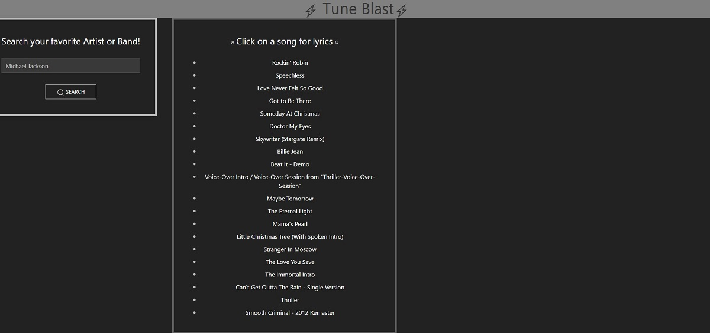
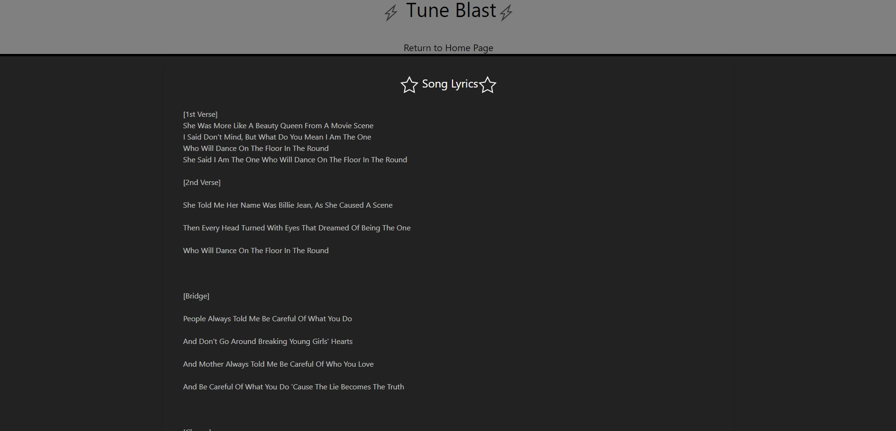

## Tune Blast

## Purpose
a website to search your favorite artist anf look up lyrics to their songs.

## How to Use
The footer brings you back to the top of the page and the header has a cool animation to enjoy. Start by typing the name of the artist you wish to see songs by into the input field. then click "search". this will bring up songs by the requested artist. the songs will be clickable to bring up the songs lyrics page. the header on this page will return you to the homepage as well as the footer.

## Built With
* HTML
* CSS
* javascript
* UiKit
* Api.musicMatch.com
* api.lyrics.ovh
## Website
 https://mpeterson56.github.io/Tune-Blast/

## Contribution
Made by: Angel Van de Feniks & Michael Peterson

### ©️2022 Tune Blast
